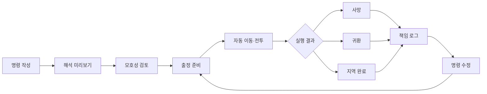
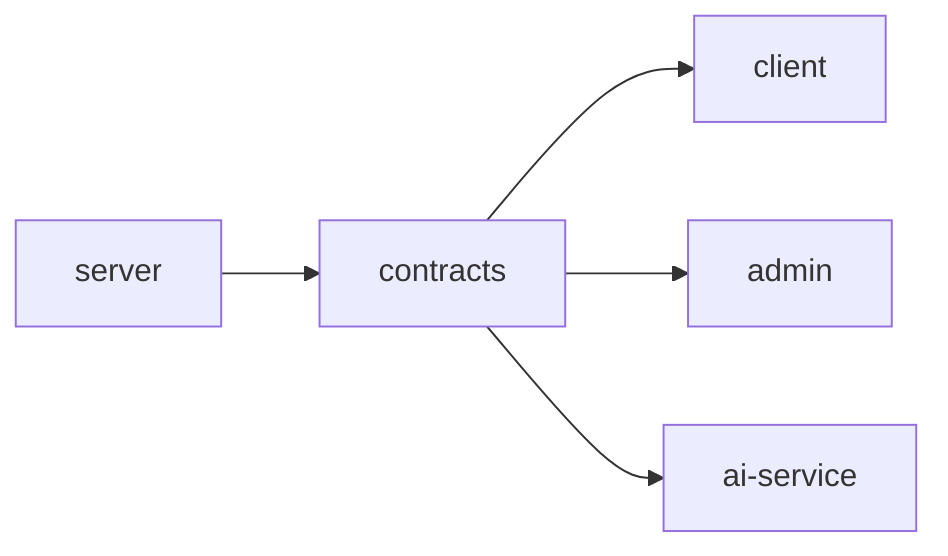
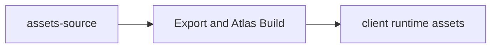
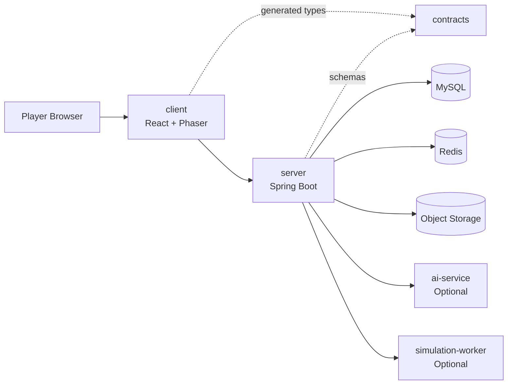
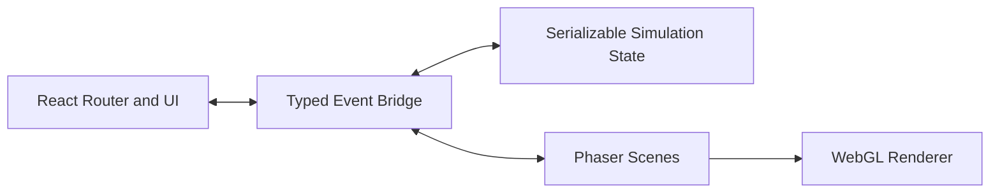
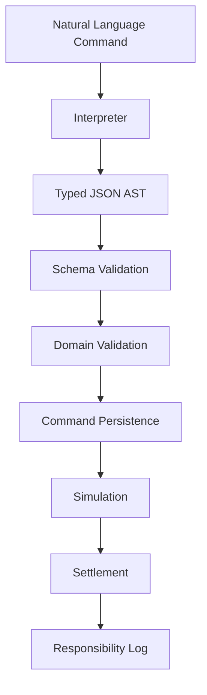
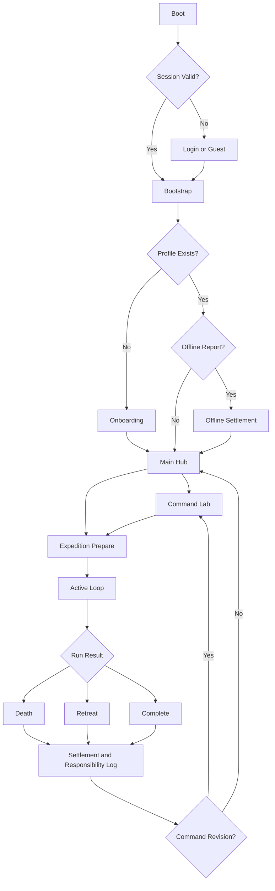

# Vibe: Unbound

> **Control, Mistake, and Responsibility.**  
> 자연어 명령의 모호성이 실제 행동과 사고로 이어지는 AI 자동화 로그라이크·방치형 RPG

<p align="center">
  <strong>React · TypeScript · Vite · Phaser · Java · Spring Boot · MySQL · Docker</strong>
</p>

---

## Organization README 위치

이 문서는 GitHub Organization 프로필용 README입니다.

```text
.github/
└── profile/
    └── README.md
```

Organization의 `.github` 저장소에 위 경로로 배치하면 Organization 메인 화면에 표시됩니다.

---

# 1. Project Overview

**Vibe: Unbound**는 플레이어가 캐릭터를 직접 조작하는 대신, 자연어로 행동 규칙을 설계하는 브라우저 기반 RPG입니다.

플레이어가 작성한 명령은 제한된 규칙 구조로 변환되고, 캐릭터는 해당 규칙을 기준으로 자동 이동, 전투, 휴식, 귀환 등의 행동을 수행합니다. 모호한 표현은 의도하지 않은 결과를 만들 수 있으며, 플레이어는 사고 기록을 분석하고 명령을 수정해 다음 원정을 준비합니다.

```text
명령 작성
→ 명령 해석
→ 자동 실행
→ 전투·이벤트 발생
→ 오해 또는 사고
→ 사망·귀환·지역 완료
→ 책임 로그 분석
→ 명령 수정
→ 재출정
```

## Core Theme

```text
Control
플레이어는 행동을 직접 조작하지 않고 규칙을 설계한다.

Mistake
모호한 명령은 예상하지 못한 행동과 사고를 발생시킨다.

Responsibility
사고는 원래 명령, 해석 결과, 실제 상황과 연결되어 설명된다.
```

---

# 2. Core Gameplay

## Player Role

플레이어는 전투 캐릭터의 직접 조작자가 아니라 **명령 설계자**입니다.

- 자연어 행동 규칙 작성
- 조건과 행동의 우선순위 설정
- 명령의 모호성 확인
- 위험 감수 여부 결정
- 자동 실행 결과 관찰
- 사망과 실패 원인 분석
- 명령 개선
- 장비와 성장 방향 결정

## Example

```text
사용자 명령
"체력이 낮으면 쉬어"

시스템 해석
IF HP < 5% → REST

실제 상황
HP 8%, 슬라임 3마리와 전투 중

결과
휴식 조건 불충족
→ 전투 지속
→ 캐릭터 사망
```

개선된 명령:

```text
체력이 최대 체력의 30% 미만이면
전투에서 이탈한 뒤 안전한 장소에서 휴식해
```

## Primary Loop



---

# 3. Product Principles

## 3.1 Explainable Failure

모든 중요한 실패는 다음 정보로 설명되어야 합니다.

- 사용자가 작성한 원래 명령
- 시스템이 변환한 규칙
- 명령 실행 당시의 게임 상황
- 시스템이 선택한 행동
- 해당 행동으로 발생한 결과
- 모호성의 원인
- 개선 가능한 명령 예시

일반 전투 로그와 책임 로그는 별도의 개념으로 관리합니다.

## 3.2 Rule-Driven Gameplay

게임 결과는 단순 무작위가 아니라 다음 요소의 조합으로 결정됩니다.

```text
사용자 명령
+ 파싱된 규칙
+ 명령 우선순위
+ 캐릭터 상태
+ 월드 상태
+ 게임 규칙
+ 제한된 확률 요소
```

## 3.3 Safe AI Integration

자연어 명령을 실행 가능한 JavaScript 코드로 직접 변환하지 않습니다.

### 금지

- `eval`
- `new Function`
- 검증되지 않은 LLM 출력 실행
- 사용자가 입력한 스크립트 직접 실행
- 프롬프트 결과를 게임 엔진 객체에 바로 반영
- 허용되지 않은 행동이나 필드의 동적 생성

### 허용 구조

```text
Natural Language
→ Interpreter
→ Typed JSON AST
→ Schema Validation
→ Rule Validation
→ Game Simulation
```

## 3.4 Vertical Slice First

다수의 지역과 기능을 얕게 구현하지 않습니다.

첫 번째 목표는 다음 흐름이 완전히 연결된 하나의 Vertical Slice입니다.

```text
로그인
→ 온보딩
→ 메인 허브
→ 명령 작성
→ Glimmer Woods 출정
→ 자동 전투
→ 사고 또는 귀환
→ 책임 로그
→ 명령 수정
```

## 3.5 Originality

유사 게임에서는 다음만 참고합니다.

- 정보 구조
- 사용자 흐름
- 피드백 방식
- 자동 전투 구성
- 사망·귀환·정산 패턴
- 카메라와 연출의 일반 원칙

다음은 복제하지 않습니다.

- 상용 게임 Sprite
- Tile
- UI Layout
- Sound
- Music
- Text
- Naming
- Visual Branding
- 추출된 게임 파일

---

# 4. Visual Direction

Vibe: Unbound는 두 영역의 대비를 중심으로 설계합니다.

| 영역 | 방향 |
|---|---|
| 게임 세계 | 풍부하고 따뜻한 고밀도 픽셀 판타지 |
| 명령 인터페이스 | 정밀하고 절제된 제어 패널 |
| 정상 상태 | off-white, muted blue, amber |
| 성공 상태 | restrained green |
| 위험 상태 | alert red |
| 핵심 분위기 | 아름다운 세계에서 발생하는 냉정한 자동화 사고 |

## Game World

- 5개 이상의 패럴랙스 레이어
- 달빛과 안개
- 랜턴과 모닥불
- 반딧불과 먼지 입자
- 환경 오브젝트 밀도
- Sprite Animation
- 검격과 피격 파티클
- Dynamic Light
- 선택적 Normal Map
- Camera Shake
- Hit Stop
- Selective Bloom
- Vignette
- 환경음과 전투음

## Interface

- AI SaaS가 아닌 게임 클라이언트 중심 UI
- 본문 전체를 모노스페이스 폰트로 사용하지 않음
- 상태와 행동의 위계를 먼저 표현
- 카드와 테두리를 과도하게 반복하지 않음
- 터미널 효과는 명령과 로그 영역에만 제한
- 캐릭터와 지역의 아트가 UI 안에서도 충분히 보이도록 구성
- 위험, 성공, 경고를 색상만으로 표현하지 않음

---

# 5. Organization Repository Map

```text
Vibe-Unbound/
├── .github
├── client
├── server
├── contracts
├── infra
├── docs
├── ai-service          # 분리 조건 충족 시
├── assets-source       # 원본 에셋 증가 시
├── admin               # 운영 도구 필요 시
└── simulation-worker   # 대규모 비동기 계산 필요 시
```

## Core Repositories

| Repository | Status | Purpose |
|---|---|---|
| `client` | Active | React UI와 Phaser 게임 클라이언트 |
| `server` | Planned | Spring Boot 기반 메인 게임 서버 |
| `contracts` | Planned | OpenAPI, JSON Schema, Event Contract |
| `infra` | Planned | Docker, Deployment, Monitoring |
| `docs` | Planned | Product, IA, Architecture, Design 문서 |
| `.github` | Planned | Organization 공통 정책과 템플릿 |

## Future Repositories

| Repository | 생성 조건 |
|---|---|
| `ai-service` | AI 기능을 독립 배포하거나 Python 기반 평가가 필요할 때 |
| `assets-source` | Aseprite, PSD, WAV 등 원본 바이너리가 커질 때 |
| `admin` | 사용자, 보상, 로그, 밸런스 운영 화면이 필요할 때 |
| `simulation-worker` | 오프라인 진행과 대량 시뮬레이션이 서버에 부담을 줄 때 |

---

# 6. Repository Responsibilities

## 6.1 `client`

브라우저에서 실행되는 실제 게임 클라이언트입니다.

### Technology

- React
- TypeScript
- Vite
- Phaser
- React Router
- Zustand 또는 기존 상태관리 도구
- MSW
- Vitest
- React Testing Library
- Playwright

### Responsibilities

- Boot
- 로그인과 회원가입
- 게스트 시작
- 온보딩
- 메인 허브
- 명령 작성과 수정
- 명령 해석 미리보기
- 모호성 경고
- 출정 준비
- 게임 HUD
- 인벤토리
- 캐릭터
- 책임 로그
- 결과 정산
- Phaser 게임 런타임
- React와 Phaser 사이의 Typed Bridge

### Recommended Structure

```text
client/
├── src/
│   ├── app/
│   │   ├── router.tsx
│   │   ├── providers/
│   │   ├── guards/
│   │   └── bootstrap/
│   ├── features/
│   │   ├── auth/
│   │   ├── onboarding/
│   │   ├── hub/
│   │   ├── commands/
│   │   ├── expedition/
│   │   ├── settlement/
│   │   ├── character/
│   │   ├── inventory/
│   │   └── responsibility-log/
│   ├── game/
│   │   ├── config/
│   │   ├── scenes/
│   │   ├── entities/
│   │   ├── systems/
│   │   ├── simulation/
│   │   ├── bridge/
│   │   ├── lighting/
│   │   ├── particles/
│   │   ├── camera/
│   │   ├── audio/
│   │   └── assets/
│   ├── shared/
│   └── mocks/
├── public/
├── tests/
└── docs/
```

### React and Phaser Boundary

```text
React
├── 인증
├── 라우팅
├── 폼
├── 허브
├── 메뉴
├── HUD
├── 명령 편집기
└── 결과 화면

Phaser
├── 게임 루프
├── 월드
├── 캐릭터
├── 몬스터
├── 타일맵
├── 카메라
├── 전투 렌더링
├── 조명
├── 파티클
└── 공간 오디오 이벤트
```

### Client Rules

- React state로 프레임 단위 게임 월드를 렌더링하지 않습니다.
- 게임 오브젝트마다 DOM Element를 만들지 않습니다.
- Phaser Scene 하나에 모든 로직을 넣지 않습니다.
- 시뮬레이션 상태와 렌더링 상태를 분리합니다.
- Mock 데이터는 API 계층을 통해 사용합니다.
- `client`에 백엔드 Secret을 저장하지 않습니다.

---

## 6.2 `server`

Spring Boot 기반 메인 게임 서버입니다.

초기에는 마이크로서비스가 아닌 **모듈러 모놀리스**로 구현합니다.

### Technology

- Java
- Spring Boot
- Spring Security
- Spring Data JPA
- MySQL
- Redis
- Flyway
- OpenAPI
- Docker

### Responsibilities

- 계정과 인증
- 캐릭터 프로필
- 명령 저장
- 명령 AST 검증
- 명령 우선순위
- 지역 데이터
- 아이템 데이터
- Run 생성과 저장
- 결과 검증
- 오프라인 진행
- 보상 정산
- 책임 로그
- 인벤토리
- 장비
- 캐릭터 성장

### Recommended Structure

```text
server/
├── src/main/java/com/vibeunbound/
│   ├── auth/
│   ├── account/
│   ├── player/
│   ├── command/
│   ├── expedition/
│   ├── run/
│   ├── settlement/
│   ├── offline/
│   ├── inventory/
│   ├── progression/
│   ├── responsibilitylog/
│   └── shared/
├── src/main/resources/
│   ├── db/migration/
│   └── application.yml
├── src/test/
├── Dockerfile
└── docs/
```

### Initial Rule

초기에는 다음 저장소나 서비스를 따로 만들지 않습니다.

```text
auth-service
player-service
inventory-service
run-service
settlement-service
```

도메인과 패키지 경계를 먼저 명확하게 유지하고, 배포와 확장의 필요성이 확인된 뒤 분리합니다.

### Transaction Principles

- Run 생성과 초기 자원 차감은 하나의 트랜잭션으로 처리
- 결과 정산은 중복 요청에도 안전하도록 Idempotent하게 구성
- 보상 지급과 Run 종료 상태 변경의 원자성 보장
- 책임 로그는 정산 결과와 연결
- 클라이언트가 제출한 최종 보상을 그대로 신뢰하지 않음

---

## 6.3 `contracts`

프론트엔드, 백엔드, AI 서비스가 공유하는 기계 판독 가능한 계약 저장소입니다.

### Responsibilities

- OpenAPI Specification
- JSON Schema
- Event Schema
- 요청과 응답 예제
- Breaking Change 관리
- TypeScript Client 생성
- 계약 버전 관리

### Recommended Structure

```text
contracts/
├── openapi/
│   └── openapi.yaml
├── schemas/
│   ├── command.schema.json
│   ├── run-event.schema.json
│   ├── responsibility-log.schema.json
│   └── offline-report.schema.json
├── events/
│   └── event-catalog.md
├── examples/
├── scripts/
└── README.md
```

### Contract Flow



### Rules

- 프론트와 백엔드가 DTO를 각각 수작업으로 중복 정의하지 않습니다.
- OpenAPI 또는 JSON Schema를 기준으로 타입을 생성합니다.
- 명령 AST 변경은 하위 호환성을 확인합니다.
- 계약 변경은 `client`와 `server` 담당자 모두 검토합니다.
- Breaking Change는 버전과 Migration Plan을 포함합니다.

---

## 6.4 `infra`

개발, 테스트, 운영 환경의 인프라 구성을 관리합니다.

### Responsibilities

- Docker Compose
- Reverse Proxy
- AWS Infrastructure
- Domain
- HTTPS
- MySQL
- Redis
- Object Storage
- CI/CD
- Monitoring
- Log Collection
- Backup
- Environment Template

### Recommended Structure

```text
infra/
├── compose/
│   ├── compose.local.yml
│   ├── compose.dev.yml
│   └── compose.prod.yml
├── terraform/
│   ├── modules/
│   └── environments/
│       ├── dev/
│       ├── staging/
│       └── prod/
├── nginx/
├── monitoring/
├── scripts/
└── docs/
```

### Secret Policy

저장 가능한 값:

```env
DB_HOST=
DB_PORT=
REDIS_HOST=
LLM_PROVIDER=
LOG_LEVEL=
```

저장하면 안 되는 값:

```env
DB_PASSWORD=real-password
JWT_SECRET=real-secret
OPENAI_API_KEY=real-key
AWS_SECRET_ACCESS_KEY=real-key
```

실제 Secret은 다음 중 하나에서 관리합니다.

- GitHub Actions Secrets
- AWS Secrets Manager
- AWS Systems Manager Parameter Store
- 동등한 Secret Manager

---

## 6.5 `docs`

Organization 전체에서 공유하는 사람이 읽는 문서를 관리합니다.

### Recommended Structure

```text
docs/
├── product/
│   ├── vision.md
│   ├── game-loop.md
│   └── roadmap.md
├── ia/
│   ├── sitemap.md
│   ├── user-flow.md
│   ├── screen-spec.md
│   └── state-machine.md
├── architecture/
│   ├── system-context.md
│   ├── container-diagram.md
│   ├── data-flow.md
│   └── adr/
├── design/
│   ├── design-system.md
│   ├── typography.md
│   ├── color.md
│   └── motion.md
├── game-design/
│   ├── commands.md
│   ├── combat.md
│   ├── progression.md
│   ├── economy.md
│   └── offline-system.md
├── art/
│   ├── pixel-art-guide.md
│   ├── asset-pipeline.md
│   └── glimmer-woods-art-bible.md
└── api/
    └── overview.md
```

### Documentation Boundary

| 문서 종류 | 위치 |
|---|---|
| OpenAPI 원본 | `contracts` |
| JSON Schema 원본 | `contracts` |
| API 설명 문서 | `docs/api` |
| 시스템 전체 아키텍처 | `docs/architecture` |
| 저장소 내부 구현 문서 | 각 저장소의 `docs/` |
| 디자인 시스템 | `docs/design` |
| 게임 규칙과 밸런스 | `docs/game-design` |

---

## 6.6 `.github`

GitHub Organization 전체에 적용되는 공통 정책과 템플릿입니다.

### Recommended Structure

```text
.github/
├── profile/
│   └── README.md
├── ISSUE_TEMPLATE/
│   ├── bug_report.yml
│   ├── feature_request.yml
│   ├── research.yml
│   ├── game_design.yml
│   └── art_request.yml
├── workflow-templates/
├── PULL_REQUEST_TEMPLATE.md
├── CONTRIBUTING.md
├── CODE_OF_CONDUCT.md
├── SECURITY.md
└── SUPPORT.md
```

### Responsibilities

- Organization 프로필
- Issue Template
- Pull Request Template
- 기여 규칙
- 보안 정책
- 공통 Workflow Template
- 지원과 문의 방식

> `CODEOWNERS`는 각 저장소의 `.github/CODEOWNERS`에 두는 것을 기본으로 합니다. 저장소별 책임 범위가 다르기 때문입니다.

---

## 6.7 `ai-service`

초기에는 생성하지 않아도 됩니다.

Spring Boot `server` 내부의 `command` 모듈에서 시작하고 다음 조건이 생기면 분리합니다.

### Separation Conditions

- Python 기반 모델 또는 평가 코드 필요
- AI 기능을 별도로 배포해야 함
- AI 요청량이 일반 API와 다른 방식으로 확장됨
- 여러 LLM Provider를 라우팅해야 함
- Prompt Evaluation과 Dataset 관리가 필요함
- AI 장애를 일반 게임 API 장애와 분리해야 함

### Recommended Structure

```text
ai-service/
├── app/
│   ├── api/
│   ├── interpreter/
│   ├── prompts/
│   ├── validation/
│   └── providers/
├── datasets/
├── evaluations/
├── tests/
├── Dockerfile
└── README.md
```

### Responsibility Boundary

AI 서비스는 명령 해석 후보를 생성할 수 있지만, 최종 실행 가능 여부는 서버의 검증 계층이 결정합니다.

```text
LLM Output
→ Schema Validation
→ Domain Validation
→ Allowed Metric Check
→ Allowed Action Check
→ Server Decision
```

---

## 6.8 `assets-source`

Aseprite, PSD, Krita, WAV 등의 제작 원본을 관리합니다.

### Recommended Structure

```text
assets-source/
├── characters/
│   ├── player/
│   └── enemies/
├── environments/
├── ui/
├── vfx/
├── normal-maps/
├── audio-source/
├── exports/
└── licenses/
```

### Asset Flow



### Rules

- 원본 바이너리는 Git LFS 사용
- 런타임 PNG, Atlas JSON, OGG는 `client`
- 원본과 Export 결과를 구분
- 라이선스 문서 필수
- 파일명 규칙 통일
- 상용 게임에서 추출한 에셋 사용 금지

---

## 6.9 `admin`

운영 도구가 필요해질 때 생성합니다.

### Responsibilities

- 사용자 검색
- 계정 상태 관리
- 제재와 해제
- 명령 해석 결과 조회
- 책임 로그 조회
- 아이템과 보상 지급
- 게임 밸런스 데이터 관리
- 지역과 아이템 데이터 관리
- 서버 상태 확인
- 운영 감사 로그

### Security

- 일반 게임 API와 운영 API 분리
- 관리자 권한 분리
- 모든 변경 기록 감사 로그 저장
- 보상 지급과 계정 제재는 이중 확인 지원
- 운영 계정에 MFA 적용 검토

---

## 6.10 `simulation-worker`

대량 또는 장시간 시뮬레이션을 비동기로 처리합니다.

### Separation Conditions

- 오프라인 진행 계산 시간이 길어짐
- 다수 사용자의 시뮬레이션이 동시에 실행됨
- 메인 API 응답 지연이 발생함
- Run Replay와 대량 결과 예측이 필요함
- 재시도가 가능한 작업 큐가 필요함

### Responsibilities

- 오프라인 진행
- Run 결과 계산
- 대량 명령 평가
- 로그 집계
- 비동기 보상 계산
- 실패 작업 재처리

---

# 7. System Architecture

## High-Level Architecture



## Client Runtime



## Command Execution



---

# 8. Main Product Flow



---

# 9. Main Routes

```text
/auth/login
/auth/signup
/auth/recover

/onboarding/character
/onboarding/intro
/onboarding/contract
/onboarding/first-command
/onboarding/incident
/onboarding/result

/game/hub
/game/commands
/game/commands/new
/game/commands/:commandId
/game/prepare
/game/run/:runId
/game/result/:runId
/game/offline-report
/game/character
/game/inventory
/game/logs
/game/settings
```

---

# 10. Initial API Scope

```text
POST   /api/auth/login
POST   /api/auth/guest
POST   /api/auth/logout
POST   /api/auth/signup
POST   /api/auth/recover
GET    /api/bootstrap

POST   /api/profiles
GET    /api/profiles/current
PATCH  /api/profiles/current

GET    /api/commands
POST   /api/commands/preview
POST   /api/commands
GET    /api/commands/{commandId}
PATCH  /api/commands/{commandId}
DELETE /api/commands/{commandId}
POST   /api/commands/{commandId}/activate

GET    /api/regions

POST   /api/runs
GET    /api/runs/{runId}
POST   /api/runs/{runId}/pause
POST   /api/runs/{runId}/resume
POST   /api/runs/{runId}/retreat
GET    /api/runs/{runId}/logs
GET    /api/runs/{runId}/responsibility-logs

GET    /api/offline-report
POST   /api/offline-report/claim

GET    /api/character
GET    /api/inventory
PATCH  /api/equipment
```

---

# 11. Initial Data Domains

| Domain | Main Responsibility |
|---|---|
| Account | 로그인, 계정 상태 |
| Player | 캐릭터와 플레이어 진행 |
| Command | 자연어 명령과 AST |
| Region | 지역, 적, 조우 |
| Run | 출정과 실행 상태 |
| Settlement | 보상과 결과 정산 |
| Responsibility Log | 명령과 사고의 인과관계 |
| Inventory | 아이템과 장비 |
| Progression | 레벨, 스킬, 해금 |
| Offline | 비접속 진행 |

---

# 12. Development Roadmap

## Phase 0 — Foundation

- 기존 프론트엔드 Audit
- 기술 스택 확정
- IA 작성
- 상태머신 작성
- API 계약 작성
- Organization과 Repository 구성
- Branch와 PR 정책 구성

## Phase 1 — Authentication

- Boot
- Login
- Signup
- Guest Login
- Protected Route
- Bootstrap Mock API
- Profile Routing

## Phase 2 — Onboarding

- Character Creation
- World Introduction
- First Command
- Ambiguity Preview
- First Incident
- Responsibility Report
- Corrected Command

## Phase 3 — Main Hub

- Character Summary
- Active Commands
- Latest Incident
- Offline Summary
- Expedition Entry

## Phase 4 — Command Lab

- Command CRUD
- Interpretation Preview
- Ambiguity Score
- Priority
- Activation
- Risk Acknowledgement

## Phase 5 — Functional Vertical Slice

- React ↔ Phaser Bridge
- Glimmer Woods
- Player
- Slime
- Auto Movement
- Auto Combat
- Rest
- Death
- Retreat
- Settlement

## Phase 6 — Graphics Vertical Slice

- Tiled Map
- Parallax
- Sprite Animation
- Lighting
- Normal Map
- Particle
- Camera FX
- Audio
- Post Processing
- Performance Profiling

## Phase 7 — Responsibility System

- Responsibility Log
- Suggested Rewrite
- Incident Archive
- Run Summary
- Command Revision Flow

## Phase 8 — Offline Progression

- Offline Time Calculation
- Deterministic Simulation
- Reward Claim
- Worker Separation Review

## Phase 9 — Progression

- Inventory
- Equipment
- Skills
- Regions
- Meta Progression
- Economy

## Phase 10 — Operations

- Admin
- Monitoring
- Analytics
- Backup
- Incident Response
- Production Deployment

---

# 13. Current Priority

```text
Current Stage
Early Development / Vertical Slice

Current Main Repository
client

Current Primary Goal
Login
→ Command
→ Glimmer Woods
→ Incident
→ Responsibility Log
→ Command Revision
```

## Immediate Actions

1. GitHub Organization 생성 또는 정리
2. `.github` 저장소 생성
3. 이 README를 `.github/profile/README.md`에 등록
4. 현재 프론트엔드를 `client`로 이전
5. `docs`에 Master Specification 등록
6. `contracts`에 OpenAPI와 JSON Schema 초기화
7. `server` Spring Boot 프로젝트 초기화
8. `infra`에 Local Docker Compose 구성
9. 로그인부터 Phase 단위로 개발

---

# 14. Git Workflow

## Branch Strategy

기본은 `main + short-lived feature branch`입니다.

```text
main
feature/*
fix/*
refactor/*
test/*
docs/*
chore/*
art/*
```

`develop` Branch는 여러 팀의 장기 통합 Branch가 실제로 필요할 때만 추가합니다.

## Branch Examples

```text
feature/client-login
feature/command-preview
feature/server-run-settlement
fix/duplicate-reward
refactor/phaser-combat-system
docs/update-organization-readme
art/glimmer-woods-atlas
```

## Commit Convention

```text
feat: add command interpretation preview
fix: prevent duplicate run settlement
refactor: separate combat simulation from Phaser scene
test: add login routing tests
docs: document responsibility log schema
chore: configure lint workflow
art: add glimmer woods environment atlas
```

## Pull Request Rule

모든 PR은 다음 내용을 포함합니다.

```text
Summary
Changes
Why
Screenshots or Video
Test Result
Build Result
Known Risks
Related Issue
```

## Merge Policy

- 기본 Merge 방식: Squash Merge
- CI 실패 시 Merge 금지
- PR 리뷰 후 Merge
- 계약 변경은 프론트와 백엔드 모두 검토
- 인프라 변경은 배포 영향을 명시
- 보안 관련 변경은 별도 검토
- Breaking Change는 Migration Plan 포함

---

# 15. Issue Labels

## Area

```text
area:client
area:server
area:contracts
area:infra
area:design
area:gameplay
area:art
area:audio
area:ai
area:docs
area:security
```

## Kind

```text
kind:feature
kind:bug
kind:refactor
kind:test
kind:research
kind:chore
kind:proposal
```

## Priority

```text
priority:p0
priority:p1
priority:p2
priority:p3
```

## Status

```text
status:blocked
status:needs-review
status:ready
status:in-progress
status:needs-design
status:needs-research
```

---

# 16. Definition of Done

기능은 다음 조건을 모두 만족해야 완료로 간주합니다.

- 요구사항과 Acceptance Criteria 충족
- Lint 통과
- Unit Test 통과
- Production Build 통과
- Browser Console Error 없음
- Network Error 확인
- 접근성 기본 검증
- 관련 문서 수정
- Screenshot 또는 Video 첨부
- 알려진 제한사항 기록
- Secret과 개인정보가 포함되지 않음

게임 기능은 추가로 다음을 확인합니다.

- 실제 게임 루프에서 동작
- 정적 이미지나 GIF로 대체되지 않음
- React HUD와 Phaser 상태 일치
- 상태 전이가 명확함
- 책임 로그 생성 가능
- 성능 Budget을 초과하지 않음

---

# 17. Quality Standards

## Code Quality

- TypeScript Strict Mode
- Java의 명확한 Null 처리
- `any` 남용 금지
- 검증 없는 Type Assertion 금지
- 거대한 Component 금지
- 거대한 단일 Phaser Scene 금지
- 순수 로직과 렌더링 분리
- API 계층과 Domain 계층 분리
- 테스트 가능한 함수
- 중복 DTO 금지
- 명시적인 상태 전이

## Backend Reliability

- 트랜잭션 경계 명확화
- 중복 정산 방지
- Idempotency 고려
- 낙관적 또는 비관적 Lock 필요성 검토
- Flyway Migration 사용
- 운영 예외 응답 통일
- 재시도 가능한 작업과 불가능한 작업 구분
- Client 결과를 무조건 신뢰하지 않음

## Security

- Secret Commit 금지
- 비밀번호 저장 금지
- 운영 Token의 `localStorage` 저장 금지
- 자연어 명령 코드 실행 금지
- 모든 입력 Schema 검증
- 관리자 권한 분리
- Rate Limit 검토
- Dependency Vulnerability 확인
- 민감 로그 Masking
- CORS와 Cookie 정책 명시

## Performance

- 60 FPS 목표
- Texture Atlas
- Object Pooling
- Off-screen Culling
- Light Budget
- Particle Budget
- React 매 프레임 렌더 금지
- 바이옴 단위 Lazy Loading
- 장시간 시뮬레이션 Worker 분리 검토
- 이미지와 오디오 최적화

## Accessibility

- 키보드 접근
- 명확한 Focus 상태
- 충분한 텍스트 대비
- 색상 외 상태 표현
- `prefers-reduced-motion`
- UI 확대 대응
- Form Label
- 오류 메시지 연결
- 주요 HUD 정보의 텍스트 대체

## Documentation

- 중요한 구조 변경은 ADR 작성
- API 변경은 `contracts` 우선
- 구현과 문서 불일치 방지
- 조사 문서에 출처와 날짜 기록
- 폐기된 설계는 상태를 명시
- README의 실행법 최신 상태 유지

---

# 18. Testing Strategy

## Client

- Unit Test
- React Component Test
- Router Test
- Mock API Test
- Phaser와 분리된 Simulation Test
- Playwright E2E
- Visual Regression 검토

## Server

- Unit Test
- Slice Test
- Integration Test
- Repository Test
- Security Test
- Flyway Migration Test
- Idempotency Test
- Concurrency Test

## Contracts

- OpenAPI Validation
- JSON Schema Validation
- Example Validation
- Breaking Change Detection
- Generated Client Build Test

## E2E Main Scenario

```text
로그인
→ 프로필 없음
→ 캐릭터 생성
→ 첫 명령 작성
→ 모호성 확인
→ 출정
→ 첫 사고
→ 책임 로그 확인
→ 명령 수정
→ 재출정
```

---

# 19. CI/CD Baseline

모든 코드 저장소는 최소 다음 검사를 수행합니다.

```text
Formatting
Lint
Unit Test
Build
Dependency Audit
Artifact Upload
```

## Client Additional Checks

```text
E2E Smoke Test
Bundle Size Check
Asset Reference Validation
```

## Server Additional Checks

```text
Integration Test
Flyway Migration Validation
Container Build
```

## Contracts Additional Checks

```text
OpenAPI Validation
JSON Schema Validation
Breaking Change Detection
Client Generation Test
```

## Infra Additional Checks

```text
Docker Compose Validation
Terraform Format
Terraform Validate
Security Scan
```

---

# 20. Environment Strategy

| Environment | Purpose |
|---|---|
| Local | 개발자 로컬 실행 |
| Dev | 통합 개발 환경 |
| Staging | 배포 전 검증 |
| Production | 실제 서비스 |

환경마다 다음을 분리합니다.

- API URL
- Database
- Redis
- Object Storage
- LLM Provider
- Log Level
- Feature Flag
- Monitoring
- Cookie Domain
- CORS Origin

---

# 21. Local Development

각 저장소의 실제 README가 최우선입니다.

## Client

```bash
git clone https://github.com/<organization>/client.git
cd client

npm install
npm run dev
```

## Server

```bash
git clone https://github.com/<organization>/server.git
cd server

./gradlew bootRun
```

Windows:

```powershell
.\gradlew.bat bootRun
```

## Infrastructure

```bash
git clone https://github.com/<organization>/infra.git
cd infra

docker compose -f compose/compose.local.yml up -d
```

## Recommended Local Order

```text
1. MySQL
2. Redis
3. server
4. client
5. optional ai-service
6. optional worker
```

---

# 22. Asset Pipeline

## Tools

| Purpose | Tool |
|---|---|
| Sprite Animation | Aseprite |
| Atlas Packing | TexturePacker 또는 재현 가능한 CLI |
| Tilemap | Tiled |
| Normal Map | SpriteIlluminator 또는 대체 도구 |
| Audio Editing | Audacity 등 |
| PNG Optimization | pngquant, oxipng 등 |

## Runtime Flow

```text
Aseprite / Source Files
→ Export
→ Texture Atlas
→ Validation
→ Client Runtime Assets
```

## Rules

- Source와 Runtime Asset 분리
- Atlas 이름과 Animation Tag 통일
- 원본 해상도와 내부 렌더 해상도 기록
- License 문서 유지
- 사용하지 않는 Export 파일 제거
- 대형 바이너리는 Git LFS 사용

---

# 23. Design System Governance

디자인 시스템은 `docs/design`에서 정의하고 `client`에서 구현합니다.

## Source of Truth

```text
docs/design/design-system.md
→ design tokens
→ client styles
→ React components
→ Storybook or equivalent preview
```

## Managed Elements

- Typography
- Color
- Spacing
- Radius
- Border
- Elevation
- Icon
- Motion
- Navigation
- Button
- Input
- Card
- Modal
- Tooltip
- HUD
- Command Editor
- Responsibility Log

## Design Rule

일반적인 SaaS Dashboard 형태가 아니라, 게임 화면과 게임 클라이언트 경험을 기준으로 합니다.

---

# 24. Ownership

권장 Team 구조:

| Team | Responsibility |
|---|---|
| Frontend | React UI, Phaser Integration |
| Backend | Spring Boot, Data, Auth, Settlement |
| Game Systems | Command Rules, Simulation, Balance |
| Design | IA, UX, Design System |
| Art | Pixel Art, Animation, VFX |
| Platform | Infrastructure, CI/CD, Monitoring |

## CODEOWNERS Example

각 저장소의 `.github/CODEOWNERS`에서 관리합니다.

```text
# client
*                         @<organization>/frontend
/src/game/                @<organization>/frontend @<organization>/game-systems

# server
*                         @<organization>/backend
/src/main/**/command/     @<organization>/backend @<organization>/game-systems

# contracts
*                         @<organization>/frontend @<organization>/backend

# infra
*                         @<organization>/platform

# docs
/design/                  @<organization>/design
/game-design/             @<organization>/game-systems
/art/                     @<organization>/art
```

실제 Organization과 Team 이름에 맞춰 변경합니다.

---

# 25. Contribution

1. Issue를 생성하거나 기존 Issue를 선택합니다.
2. 범위와 Acceptance Criteria를 확인합니다.
3. 짧게 유지되는 Branch를 생성합니다.
4. 구현과 테스트를 수행합니다.
5. 관련 문서를 수정합니다.
6. Pull Request를 생성합니다.
7. CI와 리뷰를 통과합니다.
8. Squash Merge합니다.

큰 구조 변경은 코드 작성 전에 Proposal 또는 ADR을 작성합니다.

---

# 26. Decision Records

다음 변경은 ADR을 요구합니다.

- 게임 엔진 교체
- 상태관리 도구 교체
- 인증 방식 변경
- 모놀리스에서 서비스 분리
- Database 변경
- 메시지 큐 도입
- 명령 AST 구조 변경
- 저장 방식 변경
- 배포 플랫폼 변경
- Phaser와 React 경계 변경

ADR 형식:

```text
Title
Status
Context
Decision
Alternatives
Consequences
Migration Plan
```

---

# 27. Security Reporting

보안 취약점은 공개 Issue로 등록하지 않습니다.

`.github/SECURITY.md`에 다음 내용을 정의합니다.

- 지원 중인 Version
- 비공개 신고 방법
- 응답 예상 시간
- 공개 절차
- 보상 정책 여부

민감한 정보가 Git에 Commit된 경우:

```text
1. Secret 즉시 폐기
2. 새 Secret 발급
3. 영향 범위 조사
4. Git History 제거 필요성 검토
5. 사고 기록 작성
6. 재발 방지 조치
```

---

# 28. License and Asset Rights

라이선스가 확정되기 전까지 모든 코드, 문서, 아트, 오디오 자산은 **All Rights Reserved**로 취급합니다.

오픈소스 라이선스를 적용할 경우 다음을 분리해서 결정합니다.

- Source Code License
- Documentation License
- Art Asset License
- Audio Asset License
- Third-Party Licenses

각 저장소는 다음 파일을 포함해야 합니다.

```text
LICENSE
THIRD_PARTY_NOTICES.md
```

`assets-source`는 추가로 다음을 포함합니다.

```text
licenses/
asset-register.csv
```

---

# 29. Discussions and Communication

프로젝트 관련 논의는 GitHub Issues와 Discussions를 사용합니다.

| Purpose | Channel |
|---|---|
| Bug | Issue `kind:bug` |
| Feature | Issue `kind:feature` |
| Research | Issue `kind:research` |
| Architecture | Discussion 또는 ADR |
| Game Design | Discussion 또는 `area:gameplay` |
| Design Proposal | Discussion 또는 `area:design` |
| Security | Private Security Report |
| General Question | Discussions Q&A |

---

# 30. Final Goal

Vibe: Unbound의 첫 번째 완성 기준은 많은 콘텐츠가 아닙니다.

다음 하나의 경험을 완성하는 것이 우선입니다.

```text
사용자가 로그인한다.
→ 캐릭터를 생성한다.
→ 자연어 명령을 작성한다.
→ 시스템이 명령을 해석한다.
→ 사용자가 모호성을 확인한다.
→ 캐릭터가 Glimmer Woods로 출정한다.
→ 실제 Phaser 게임 루프가 실행된다.
→ 명령 해석으로 사고가 발생한다.
→ 사용자가 책임 로그를 확인한다.
→ 사용자가 더 정확한 명령으로 수정한다.
→ 다시 출정해 결과가 달라진다.
```

이 Vertical Slice가 안정적으로 동작한 뒤 지역, 아이템, 성장, 오프라인 진행, 운영 도구를 확장합니다.

---

<p align="center">
  <strong>Vibe: Unbound</strong><br/>
  Control, Mistake, and Responsibility.
</p>
