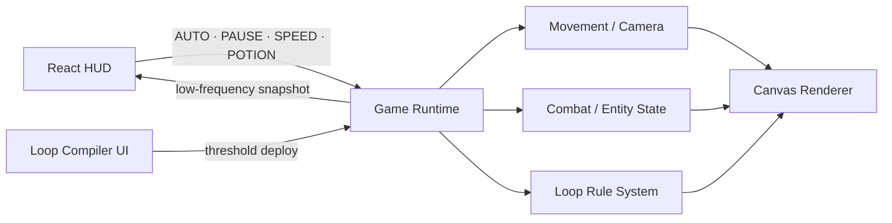

<div align="center">
  

  <br />

  <p><strong>자연어로 행동 루프를 설계하고, 모호한 명령의 비용을 직접 감당하는 AI 방치형 RPG</strong></p>
  <p><code>Control</code> · <code>Mistake</code> · <code>Responsibility</code></p>

  <p>
    
    
    
    
  </p>
</div>

---

## 프로젝트 한 줄 소개

> **“체력 낮으면 쉬어.”**라는 한 문장이 `HP < 5% → REST`로 해석되면, 캐릭터는 플레이어가 없는 6시간 동안 죽기 직전까지 전투를 반복한다.

**Vibe: Unbound**는 자연어 명령을 반복 가능한 행동 규칙으로 컴파일하고, 그 규칙이 방치 시간 동안 누적해서 만들어 내는 결과를 플레이하는 게임이다.

| 사용자가 의도한 것 | 컴파일된 규칙 | 반복 실행의 결과 |
|---|---|---|
| 체력이 위험하면 안전하게 휴식 | `IF hp < 5% → REST` | 체력 5% 전까지 계속 전투 |
| 강한 몬스터는 피하기 | `AVOID level > 99` | 사실상 모든 몬스터와 교전 |
| 돈 되는 물건 판매 | `SELL item.value > 0` | 장비까지 전부 판매 |
| `HP < 30%`에서 귀환 후 회복 | 명확한 조건과 행동 | 의도한 생존 루프 실행 |

---

## 플레이 가능한 장면

<div align="center">
  
  <sub>정적 합성 이미지가 아니라, 캐릭터 좌표·몬스터 HP·공격 판정·사망·리스폰을 매 프레임 계산한다.</sub>
</div>

### 이 프로토타입에서 실제로 동작하는 것

<table>
  <tr>
    <td width="25%"><strong>월드 런타임</strong><br /><sub>실제 좌표 이동, 카메라 추적, 패럴랙스 숲, 다층 플랫폼</sub></td>
    <td width="25%"><strong>전투</strong><br /><sub>공격 프레임, 피해량, 크리티컬, 피격, 사망, 리스폰</sub></td>
    <td width="25%"><strong>Loop Rule</strong><br /><sub>HP 임계값을 변경하면 캐릭터 행동이 즉시 달라짐</sub></td>
    <td width="25%"><strong>게임 HUD</strong><br /><sub>HP·MP·EXP·골드·사망·틱·배속·AUTO 상태 연동</sub></td>
  </tr>
</table>

- 캐릭터가 가장 가까운 살아 있는 몬스터를 탐색하고 공격 범위까지 이동한다.
- 공격 애니메이션의 특정 프레임에서만 실제 피해가 발생한다.
- 몬스터 HP가 0이 되면 사망 파티클과 보상을 생성하고 일정 시간 후 리스폰한다.
- 몬스터의 반격으로 플레이어 HP가 감소하며, 사망 후 시작 지점에서 부활한다.
- 위험 규칙 `HP < 5%`에서는 낮은 체력으로 계속 사냥한다.
- 안전 규칙 `HP < 30%`를 배포하면 전투를 중단하고 실제 `REST` 상태로 회복한다.

---

## Loop Engineering

<div align="center">
  
</div>

일반적인 프롬프트 오류는 한 번의 잘못된 답변으로 끝난다. 이 게임에서는 잘못 컴파일된 규칙이 방치 시간 동안 계속 실행된다.

```text
사용자 입력     "체력 낮으면 쉬어"
       ↓
Compile Time   IF hp < 5% → REST        ambiguity 60
       ↓
Run Time       이동 → 전투 → 피격 → 재시도 → 이동 → 전투 ...
       ↓
6시간 후       deaths 47 / equipment broken / reputation loss
```

핵심 설계 원칙은 다음과 같다.

1. **언어 모델은 컴파일 시점에만 사용한다.**
2. **런타임은 결정적인 규칙 엔진으로 실행한다.**
3. **화면 효과는 실제 게임 이벤트가 발생한 순간에만 재생한다.**
4. **플레이어가 규칙을 수정하면 UI뿐 아니라 실제 행동이 변경되어야 한다.**

현재 React 프로토타입은 2번부터 4번까지를 브라우저 안에서 검증한다. 자연어를 실제 LLM 기반 `LoopSpec`으로 컴파일하는 기능은 다음 단계다.

---

## 한 장면의 플레이 흐름

<details open>
<summary><strong>위험한 기본 규칙</strong></summary>

```text
1. 체력 낮으면 쉬어
   IF hp < 5% → REST
   ambiguity 60

2. 동쪽 숲에서 사냥해
   HUNT → GLIMMER_WOODS
   ambiguity 8
```

캐릭터의 HP가 7%라면 첫 번째 조건은 거짓이다. 따라서 휴식하지 않고 다음 규칙인 `HUNT`를 실행한다.

</details>

<details>
<summary><strong>사용자가 안전 규칙으로 재컴파일</strong></summary>

```text
체력이 30% 미만이면 안전한 곳에서 쉬어.

IF hp < 30% → REST
ambiguity 8
```

`COMPILE & DEPLOY` 후 게임 엔진이 새로운 임계값을 즉시 적용한다. 캐릭터는 타깃 추적을 중단하고 `REST` 상태로 전환한 뒤 HP와 MP를 회복한다.

</details>

---

## 논리 아키텍처

<div align="center">
  
</div>



### 렌더링 경계

| 영역 | 책임 |
|---|---|
| React | HUD, 규칙 카드, 컴파일 모달, 버튼과 사용자 입력 |
| 게임 런타임 | 캐릭터와 몬스터 상태, 이동, 전투, 사망, 리스폰, Loop Rule 판정 |
| Canvas 2D | 배경, 스프라이트, 검기, 파티클, 데미지 숫자, 카메라 흔들림 |
| Snapshot | HP, MP, EXP, 골드, 사망 횟수, tick 등 HUD에 필요한 값만 React로 전달 |

프레임마다 React 상태를 갱신하지 않는다. `requestAnimationFrame`이 월드를 갱신하고 렌더링하며, HUD에는 낮은 빈도의 스냅샷만 전달한다.

> 현재 프로토타입은 빠른 시각 검증을 위해 주요 런타임이 `src/App.jsx`에 집중되어 있다. 실제 제품 단계에서는 `entities`, `systems`, `rendering`, `data` 단위로 분리하는 것이 다음 리팩터링 목표다.

---

## 실행

### 요구 환경

- Node.js 20.19 이상 또는 22.12 이상
- npm
- Chrome, Edge, Firefox 등 최신 브라우저

### 개발 서버

```bash
npm install
npm run dev
```

Vite가 출력한 로컬 주소를 브라우저에서 연다.

### 프로덕션 빌드

```bash
npm run build
npm run preview
```

Windows에서는 프로젝트 루트의 `run.bat`, macOS/Linux에서는 `run.sh`를 사용할 수 있다.

---

## 조작

| 입력 | 동작 |
|---|---|
| <kbd>A</kbd> / <kbd>←</kbd> | 왼쪽으로 수동 이동 |
| <kbd>D</kbd> / <kbd>→</kbd> | 오른쪽으로 수동 이동 |
| `AUTO` | 가장 가까운 몬스터 자동 추적·공격 전환 |
| `Ⅱ` / `▶` | 게임 업데이트 일시정지·재개 |
| `1×` / `1.5×` / `2×` | 실제 `delta time` 배속 변경 |
| 물약 슬롯 | 플레이어 HP 즉시 회복 |
| 첫 번째 규칙 카드 | Loop Compiler 열기 |
| `COMPILE & DEPLOY` | 새 HP 임계값을 런타임에 즉시 적용 |
| `↻` | 장면 초기화 |

### 60초 검증 시나리오

1. 페이지를 열고 캐릭터가 몬스터에게 이동하는지 확인한다.
2. 공격할 때 몬스터 HP가 감소하고 데미지 숫자가 생성되는지 확인한다.
3. 몬스터가 죽은 뒤 골드와 EXP가 증가하고 다시 나타나는지 확인한다.
4. 첫 번째 Loop Rule을 열어 안전 프리셋 `30%`를 선택한다.
5. `COMPILE & DEPLOY`를 누른다.
6. HP가 30% 미만일 때 캐릭터가 사냥을 중단하고 회복하는지 확인한다.

---

## 프로젝트 구조

```text
vibe-unbound-react-prototype/
├─ public/
│  └─ assets/
│     ├─ forest_far.png       # 원경 패럴랙스 레이어
│     ├─ forest_mid.png       # 중경 패럴랙스 레이어
│     ├─ forest_near.png      # 전경 패럴랙스 레이어
│     ├─ hero_sheet.png       # 플레이어 애니메이션 시트
│     ├─ slime_sheet.png      # 몬스터 애니메이션 시트
│     └─ hero_portrait.png    # HUD 초상화
├─ docs/
│  └─ readme/                 # README 전용 이미지·다이어그램
├─ src/
│  ├─ App.jsx                 # React HUD + Canvas 게임 런타임
│  ├─ main.jsx
│  └─ styles.css
├─ generate_assets.py         # 프로토타입 픽셀 에셋 재생성
├─ index.html
├─ package.json
├─ vite.config.js
├─ run.bat
└─ run.sh
```

---

## 구현 원칙

<table>
  <tr>
    <td><strong>실제 상태 우선</strong><br /><sub>캐릭터와 몬스터는 좌표, HP, 상태, 쿨다운을 가진다.</sub></td>
    <td><strong>이벤트 기반 연출</strong><br /><sub>검기와 파티클은 피해가 발생한 순간에만 생성된다.</sub></td>
  </tr>
  <tr>
    <td><strong>규칙과 행동 연결</strong><br /><sub>컴파일 결과를 변경하면 런타임 행동이 즉시 바뀐다.</sub></td>
    <td><strong>오리지널 IP</strong><br /><sub>고전 횡스크롤 RPG의 문법만 참고하고 고유 에셋·명칭은 사용하지 않는다.</sub></td>
  </tr>
</table>

---

## 현재 범위와 한계

이 저장소는 **게임 전체가 아니라 핵심 플레이 장면의 가능성을 검증하는 프로토타입**이다.

- 단일 숲 맵과 제한된 플랫폼 구조
- 브라우저 로컬 게임 상태
- 실제 LLM 컴파일러와 백엔드 미연결
- 영속 저장, 계정, 인벤토리, 퀘스트 미구현
- 프로토타입용 자체 생성 스프라이트
- 사운드 및 WebGL 셰이더 미적용
- 런타임 코드가 아직 단일 파일 중심

정적 시안보다 한 단계 더 나아가, **“이 컨셉이 실제 게임 행동으로 성립하는가”**를 검증하는 것이 현재 목표다.

---

## Roadmap

- [x] 실제 캐릭터 이동과 카메라 추적
- [x] 공격 프레임과 피해 판정 연결
- [x] 몬스터 HP·사망·리스폰
- [x] Loop Rule 임계값의 런타임 적용
- [x] AUTO·PAUSE·SPEED·POTION 제어
- [ ] 게임 엔진을 TypeScript 모듈로 분리
- [ ] 다층 플랫폼 이동, 점프, 사다리, 포탈
- [ ] `LoopSpec` JSON Schema와 자연어 컴파일러
- [ ] Java 기반 결정적 Tick Simulator
- [ ] 오프라인 진행 계산과 리플레이
- [ ] 장비, 스킬, 인벤토리, 경제 시스템
- [ ] Web Audio 및 화면 후처리
- [ ] 오리지널 정식 픽셀아트 에셋 교체

---

<div align="center">
  <br />
  <strong>모호한 프롬프트의 비용은 1이 아니라 N이다.</strong>
  <br />
  <sub>One input. Two interpretations. Thousands of consequences.</sub>
  <br /><br />
  <code>VIBE: UNBOUND</code>
</div>
